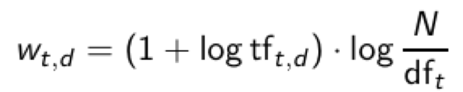
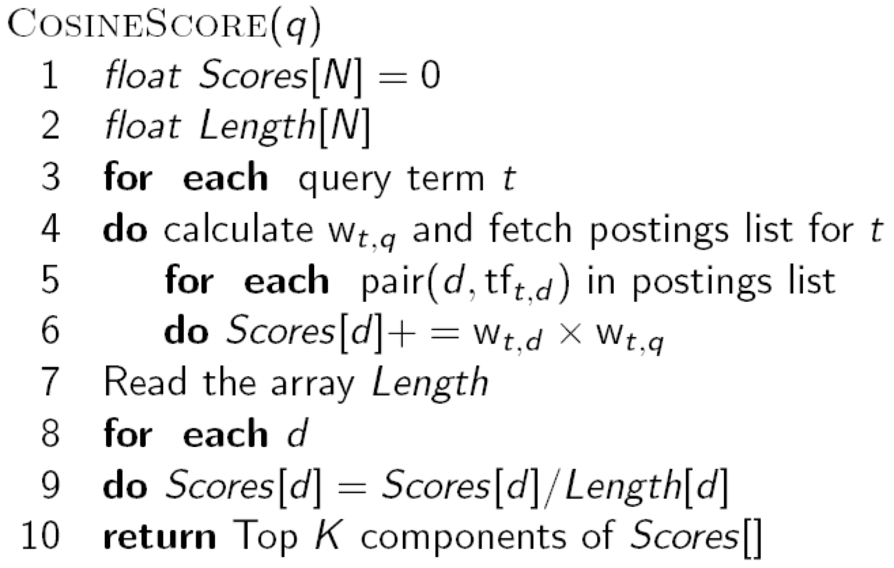

# Space Vector Model
建立倒排索引(Inverted Index)，并使用空间向量模型(Space Vector Model)对检索结果进行排序

## 依赖库
* numpy
* pyqt5
## 如何运行
```
python main.py
```
输入检索的关键词和对应的csv文件，会在当前目录下创建倒排索引表。
## 数据集结构
这里使用一个csv文件来简单代表文档的集合，csv文件的一行代表一个文档
## 倒排索引表结构
```
{词项1: {文档1: 在文档1中的频率...}...}
```
## 算法
### 词项频率 **tf**(Term Frequency)
词项t的词项频率指的是t在d中出现的次数
### 文档频率 **df**(Document Frequency)
含有词项t的文档数量  
引入这一概念是为了对罕见的词赋予一个高的权重  
### **tf-idf**权值矩阵
词项**t**在文档**d**中的权重可以采用下式计算：
  
这样我们可以得到文档-词项的权值矩阵，查询时我们以相同的计算方法求得查询内容的tf-idf向量，再和每一文档求余弦相似度，即可找出“最相似”的文档
### 查询的详细算法

